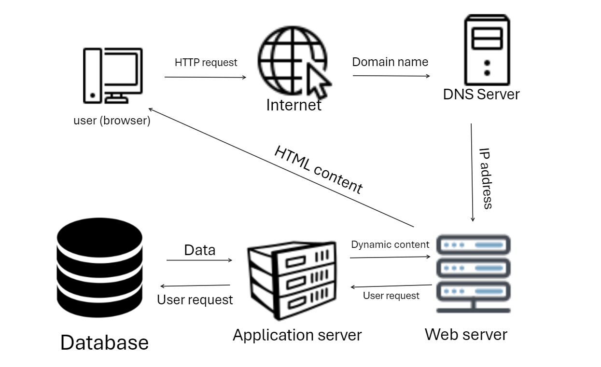

# **Description**
A simple web infrastructure hosts a website reachable through `www.foobar.com`. Each component shares the resources that the server provides (SSD, RAM and CPU).

# **Infrastructure Specifications
- What is a server?
A server is a computer hardware or software which provides services to other computers referred to as clients.
- What is the role of the domain name?
The domain name provides a human readable alias for the IP address. The domain name www.facebook.com is much easier to remember an understand than 82.198.165.176. The addresses and domain names are mapped out in the DNS (Domain Name System).
- What type of DNS record `www` is in `www.foobar.com`?
The type of DNS record `www` in `www.foobar.com` is a host A (Address Mapping) record that stores a hostname and its corresponding IPv4 address, checked bt running `dig www.foobar.com`.
- What is the role of the web server?
The web server is a piece of hardware or software that stores web server software and a website's component files (HTML docs, CSS sheets and JAVASCRIPT files), understands URLS(web addresses) and HTTP (protocol for viewing webpages), accepts browser requests and responds with selected document, hosts a website's files, and connects to the internet supporting physical data exchange.
- What is the role of the application server?
The application server hosts applications, plays an intermediate role between database servers and web servers, handle processing dynamic requests, optimizes traffic and security also providing program redundancy, and support appliation development.
- What is the server using to communicate with the computer of the user requesting the website?
The server is using protocols like HTTP and TCP/IP to communicate with the client's computer.
- The issues with the SPOF infrastructure.
The issues with single Point Of Failure are downtime and service disruptions, security vulnerabilities, significant financial implications, dependency on single components, and dependency on single personnel.
- The issues with downtime when maintenance needed (like deploying new code web server needs to be restarted).
The issues with downtime are service disruption, lost productivity, security vulnerabilities, data corruption or loss, and poor patching habits.
- The issues with inability to scale if too much incoming traffic.
If an infrastructure cannot scale to handle high levels of traffic, it can lead to performance degradation, service unavailability in extreme cases, loss of business, damage to reputation and increased costs.
