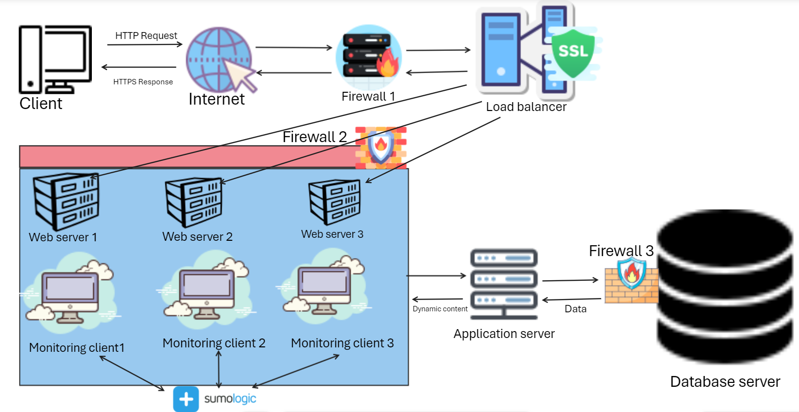

# **Description**
A three_server web infrastructure that is secured, serves encrypted data and is monitored.

# **Infrastructure Specifications**
- Explain for every additional element why you are adding it:
Firewalls are added to enforce security policies and protect against access and cyber threats by controlling incoming and outgoing traffic based on predetermined security rules. SSL certificates are used to serve traffic over `HTTPS` which encrypts data in transit, protecting user privacy and enhancing trust by ensuring that all data transmitted between client and website is secure. Monitoring clients are tools that provide insights into system performance and alert administrators to potential issues by tracking various metrics like `CPU usage`, `memory consumption`, and `application performance`.
- Explain what are firewalls for:
Firewalls are added to control network traffic based on predetermined security rules, Prevent unauthorized access into and out of a network, Identify and block potential threats, Protect network form `Distributed Denail Of Service - DDoS` attacks, and protect privacy by preventing direct contact with other networks.
- Explain why is the traffic served over HTTPS:
HTTP data is encrypted into HTTPS using `TLS Transport Layer Security` making it safer and more secure to send usernames, passwords and other sensitive data against theft while on transit when enterred into a form. HTTPS authenticates wesites preventing impersonations and used by `Google` as a quality factor in `SEO ranking`.
- Explain what monitoring is for:
Performance tracking by collecting, aggregating, and analyzing data and metrics from servers, virtual machines, containers, databases, and other backend components. Alerting by generating alerts or notifications when predefined thresholds are exceeded or anomalies detected. Ensuring availability of of citical services. Troubleshooting to prevent outages from escalating. Capacity planning and resource optimization by looking at previous infrastructure measurements. Security by identifying unusual activity that may indicate a security breach.
- Explain how monitoring tools collect data:
Systematically collect data directly from various sources such as servers, virtual machines, conatainers, databases and other backend components. Real-time monitoring providing up-to-date insights into the system's performance. Data processing and aggregating to make the data more understandable and useful. Data visualization involving dashboards with charts, graphs and other visual representations.
- Explain what to do if you want to monitor your web server QPS:
Use monitoring tools, Enable web server access logs, Use server sstatus pages, Implement custom metrics involving writing a script that parses the access logs and calculates the QPS, Set alaerts to notify when QPS exceeds a specified threshold.
* Explain what the issues are with this infrastructure:
- Why terminating SSL at the load balancer level is an issue:
While terminating `SSL - Secure Sockets Layer` can be beneficial, it also has potential security and compliance issues like data vulnerability due to unecrypted data traffic between load balancer and backend servers, Trust boundary is shifted to the load balancer, Increased complexity of the infrastructure, Potential performance issues by putting additional load on load balancer even though it may improve performance when resources are freed on the backend servers, Compliance requirements regulate that data must be encrypted all the way form the client to the server.
- Why having servers with all the same components (database, web server and application server) might be a problem:
Peformance issues due to resource contention, Security risks when an attacker gains access to all services, Maintenance challenges because updating or modifying one component can inadvertently affect others, Horizontal Scaling (adding more servers) difficulties for servers running multiple services, Single Point Of Failure SPOF for the server running alone.
