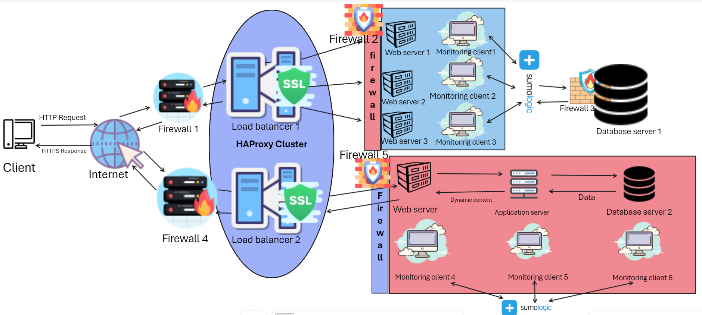

# **Description**
This is a scaled-up version of [this](https://github.com/joshkim2441/alx-system_engineering-devops/blob/master/0x09-web_infrastructure_design/2-secured_and_monitored_web_infrastructure.md) infrastructure in which all `SPOFs` have been eliminated by additon of a server, a load balancer, components split into a separaate cluster, and additional firewalls to enhance security.

# **Infrastructure Specifications**
An additional server to distribute the load hence improving speed and website scalability when handling increased traffic. An extra load balancer configured as a cluster with the existing one using `HAProxy` to ensure high availability and reliability. Split components to improve performance and security. An extra layer of firewall security. Addditional monitoring clients to collect data from the new servers.

# **Infrastructure Issues**
1. Heterogenity: The challenge of integrating diverse systems and software leading to compatibility issues.
1. Scalability: Increasing difficulty to efficiently manage and coordinate growing resources.
1. Opennes: It can be challenging to add new services if a system was not originaly designed wiith opennes in mind.
1. Concurrency: Conflicts and inconsistencies from multiple users making requests on the same resources.
1. Security: Distributed systems are potentially more exposed to a variety of security threats.
1. Data Consistency: It can be challenging when dealing with concurrent updates.
1. Transparency: It can be difficult to ensure that distributed systems appear as a single entity to users or application programmers.
